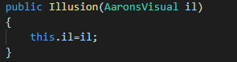
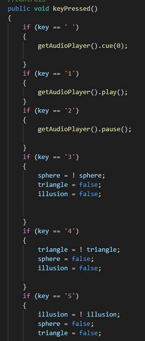
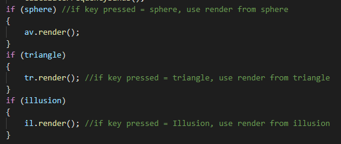
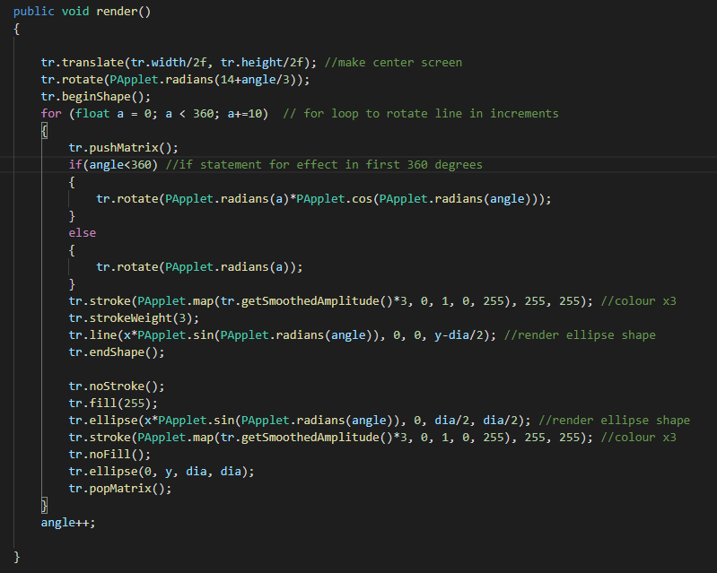
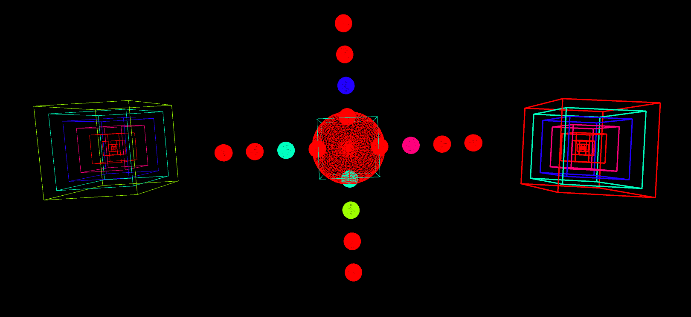
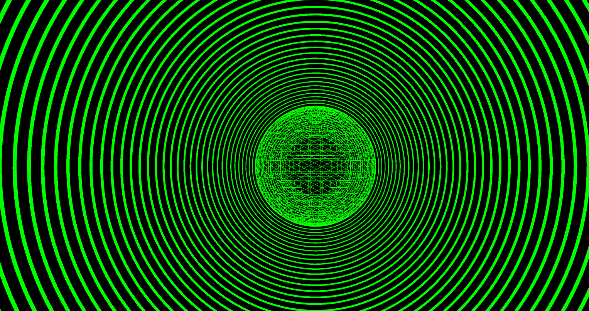

# Music Visualiser Project

Name: Aaron Healy

Student Number: c19495882

# Description of the assignment
My assignment is a music visualizer with three different visuals, it is inspired by a song from 2002 by the name "Touch me - Dj Rui Da Silva". *This song was copyrighted and I used another public domain song for the youtube video*
For this asasignment I wanted to create visuals that feel like they fit the kind of enviroment this music would be played in. 
My first visual consists of multiple shapes, all with different colours and sizes that sync together is a satisfying manner. 
My second visual is some generated art using for loops to create a cool visual.
The last of my visuals is an optical illusion, also created using for loops,which has a sphere in the centre that moves and interrupts the illusion. 
The illusion also resembles a vinyl which is the first platform is heard this track on as a kid. 
The assignment has a small bug which occurs when visual one is viewed, it centres the camera on visual one and after the other visuals are not viewable. 

# Instructions
My assignment is controlled from numbered keys and space-bar. 

1. Space-bar cues the audio player.
2. Key 1 plays the loaded music.
3. Key 2 pauses the loaded music.
4. Key 3 shows the first visual.
5. Key 4 shows the second visual
6. Key 5 shows the third visual.

# How it works

My assignment works around "AaronsVisual.java" which extends "Visual", in this file i set each of my visuals to be false so we can choose to view each as needed, by pressing the allocated keys for each visual.
Every visual/class has a contructor for initializing objects, AaronsVisual is a part of each of these to link so I could use variables in other classes.

Key pressed function is the settup for the controls of the visualizer.6 keys assigned in total.

In AaronsVisual i loaded the song and calculated average amps and frequency bands for responses in my other classes. 
The draw method also contains the renders from each corresponding class, so depending on which key is pressed AaronsVisual renders that design.

# What I am most proud of in the assignment

In this assignment I am most proud of the visual named "Triangle", altough the visual is not a triangle it is based on a more complex concept I was trying to implement and could not,
however I am still very proud of this visual and what I learned while making and adjusting it. First I created the basic necessities and then made a for loop to rotate the line I would be using.
After this I made movement by changing the values of variables X&Y with sine. I then made the end points(circles) of the line by using ellipse and declaring the diameter(dia) to 20 in size.
I then tried to add another ellipse to the end of each line however I could not get the code to work. After that I added an intro effect for the first 360 degrees of the design using an if statement.

# AaronsVisuals

First Visual 

Second Visual

Third Visual 

This is my youtube video:
(https://www.youtube.com/watch?v=2mB8dj0Qtiw&ab_channel=AaronHealy)

